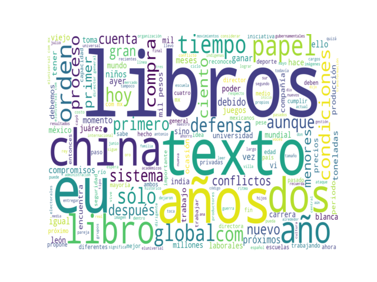
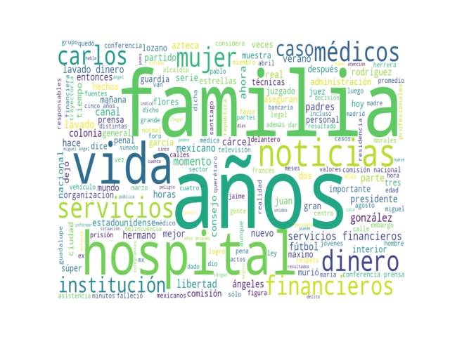

# TopicModeler

Algoritmos para descubrir temas prominentes y agrupar notas. Implementación integrada de los módulos.

El core está concebido como un pipeline modular de tal manera que el primer input del pipeline son las notas y el output depende de los módulos que se conecten, o se desconecten, del pipeline. Esto permite reusar resultados parciales porque los módulos se comunican a través de objetos en archivos.

Por ejemplo, un pipeline para vectorizar un conjunto de notas (X_Notas) sería:

> X_Notas > Espacio Vectorial (X_Notas)

y un pipeline para generar clustering por tema sería:

> X_Notas > Espacio Vectorial (X_Notas) > LDA (X_Notas)

Como los módulos se comunican a través de objetos en archivos, es posible usar los resultados parciales de un módulo y mandarlo a la entrada de otro módulo. Por ejemplo, un pipeline para generar las nubes de palabras de un conjunto del cual ya tenemos el model LDA en archivos sería:

> LDA (X_Notas) > WClouds (X_Notas)

Contar con los objetos de vectorización y LDA permite además encontrar notas de un conjunto de prueba (Y_Notas) qué coinciden con los temas producidos por otro conjunto de entrenamiento (X_Notas) con el cual se generó el modelo LDA:

> Y_Notas > LDA (X_Notas) >  Asignación de probabilidades


# Prerequisitos

Python 3 instalado, recomendado usar virtualenv con Python 3.x:


```
python --version

Python 3.7.1

```


# Dependencias

La lista de dependencias de python (hasta el momento) es la siguiente (ver el archivo `requirements.txt`).


```
numpy==1.16.4
scipy==1.3.0
sklearn==0.0
scikit-learn==0.21.2
joblib==0.13.2
dill==0.3.0
stop-words==2018.7.23
gensim==3.8.0
boto==2.49.0
boto3==1.9.188
botocore==1.12.188
urllib3==1.25.3
simplejson==3.16.0
wordcloud==1.5.0
matplotlib==3.1.1
nltk
```

Desde la raíz del proyecto se puede instalar lo necesario con pip.

```bash
pip install -r `requirements.txt`

```

# Run

Teniendo todo listo se pude probar la funcionalidad y mostrar todo el pipeline con datos de prueba.

```bash
python topic_extraction.py

```

# Generación del Espacio Vectorial

Las funciones principales de este módulo son transformar texto en vectores serializados y hacerlos compatibles con gensim. La función principal es `vectorizer()` en `services4anaest.py` y la implementación del módulo está en `anaest/vspace.py`.


### Opciones de Parametrización de la Generación Espacio Vectorial

Los argumentos de `vectorizer()` son:

* `input_docs`: La ruta de un directorio o de un archivo con los textos.

* `max_df`: El valor umbral de frecuencia máxima de término a partir del cual
se debe comenzar a excliur, por ejemplo 0.99 indica la exclusión de 
ngramas que aparecen en el 99% de los textos.

* `min_df`: El valor umbral de frecuencia mínima de término a partir del cual
se debe comenzar a excliur, por ejemplo 0.01 indica la exclusión de
ngramas que aparecen en el 1% de los textos.

* `features`: El valor máximo de features en la vectorización, por ejemplo
10000 indica que los vectores de las bolsas de palabras pueden contener
como máximo 10000 valores.

* `range_ngram`: El número máximo de palabras en los n-gramas, por ejemplo 3
indica que se deben generar n-gramas de tamaño 1,2 y 3.

* `config_file`: La ruta del archivo de parametrización.

* `out_dir`: La ruta del directorio donde se generarán los archivos de salida.


### Archivos generados después de invocar `vectorizer()`:

Dentro del directorio especificado en el argumento `out_dir` de `vectorizer()` se generarán los siguientes archivos:


* `corpus.mm` : Un vaciado a archivo de la instancia del objeto `MmCorpus` al ser serializado.  [Ver documentación](https://radimrehurek.com/gensim/auto_examples/core/run_corpora_and_vector_spaces.html#corpus-formats).

* `corpus.mm.index` : Archivo auxiliar de `corpus.mm` para hacer más eficientes los algoritmos que usan el objeto `MmCorpus` (se genera automáticamente)[Ver documentación](https://radimrehurek.com/gensim/auto_examples/core/run_corpora_and_vector_spaces.html#corpus-formats).

* `diccionario.dict` : Un vaciado a archivo de la instancia del objeto `Dictionary` de gensim, contiene un mapeo entre ngramas y el ids de los ngramas [Ver documentación](https://radimrehurek.com/gensim/corpora/dictionary.html).

* `matriz.pkl`: Matriz documento-término generada por el vectorizador de frecuencia de término `CountVectorizer` [Ver documentación](https://scikit-learn.org/stable/modules/generated/sklearn.feature_extraction.text.CountVectorizer.html#sklearn.feature_extraction.text.CountVectorizer).

* `palabras_descartadas.txt` : La lista exacta de n-gramas que fueron excluidos en la generación del modelo vectorial.

* `tdiccionario.txt`: Listado en modo texto del contenido del diccionario generado por la instancia del objeto `Dictionary` de gensim.

* `títulos` : Los títulos de los documentos procesados.

* `vectorizadorTF.pkl` : Un vaciado binario de la instancia del objeto `CountVectorizer` luego de haber procesado los documentos mediante el método `fit_transform(documents)`  [Ver documentación](https://scikit-learn.org/stable/modules/generated/sklearn.feature_extraction.text.CountVectorizer.html#sklearn.feature_extraction.text.CountVectorizer).

* `vocabulario.pkl`: Serializado de la lista de n-gramas incluidos en los vectores del espacio vectorial.


# Generación de topics con LDA

Las funciones principales de este módulo son encontrár una distribución de notas en temas y encontrar la distribución de palabras en temas usando LDA de gensim. La función principal es `topicsfinder()` en `services4anaest.py` y la implementación del módulo está en `anaest/ldaclusters.py`. 


La lista de parametros de `topicsfinder()` es:

* `input_docs`: La ruta del directorio con los textos, se usa para obtener
los nombres.

* `num_topics`: El número de temas al que se quiere ajustar el modelo.

* `iterations`: El número máximo de iteraciones en el corpus en la inferencia de la distribución de topics.

* `passes`: El número de pasadas a través del corpus durante el
entrenamiento (puede alentar para números grandes de documentos.

* `vecspace_dir`: La ruta del directorio donde se generaron los archivos de
salida generados por vectorizer() en la etapa anterior.

* `config_file`: La ruta del archivo de parametrización.

* `lda_dir`: La ruta del directorio donde se generarán los archivos de salida.


### Archivos generados después de invocar `topicsfinder()`:

Dentro del directorio especificado en el argumento `lda_dir` de `topicsfinder()`
se generarán los siguientes directorios y archivos:

* `clusters/cluster_i.csv`: Contiene una tabla csv por cada cluster i
    en formato: clusterID,docID,probabilidad,textito

* `clusters/list_clusters.csv` : contiene una tabla con información de todos
    los clusters en formato: topic,ndocs,maxprob,text

* `modelos/` : Contiene todos los archivos generados al serializar una
    instancia gensim.models.ldamulticore.LdaMulticore mediante el método save.


#### Listado de Opciones de Parametrización de la Generación de topics con LDA


Cabe mencionar que como hay muchos parámetros del algoritmo de LDA, resulta conveniente usar un archivo de configuración `resources/config.cfg` donde se puede modificar todo lo que la implementación de gensim permite. La lista completa de parametros de gensim LDA es:

* `num_topics` (int, optional) – El número de topics a extraer del corpus de entrenamiento.

* `distributed` (bool, optional) – Indica si debe usarse cómputo distribuido para acelerar el entrenamiento si el valor es `True` , cuando es `False` afecta al parámetro `alpha` porque no se puede usar con valor `auto`.

* `chunksize` (int, optional) – Número de documentos a utilizar en cada chunk de entrenamiento.

* `passes` (int, optional) – Número de pasadas a través del corpus durante el entrenamiento.

* `update_every` (int, optional) – Número de documentos a ser iterados por cada actualización; el valor 0 indica "batch learning" mientras que , > 1 indica "online iterative learning".

* `alpha` ({numpy.ndarray, str}, optional) – Es el valor del hyperparámetro de la distribución de Dirichlet para las probabilidades de los documentos en los topics (theta en la literatura). Puede ser inicializado mediante un arreglo 1D cuya longitud sea igual al número de temas esperados de manera que cada entrada en el arreglo expresa la probabilidad a priori esperada para cada topic. Alternativamente se puede usar como valor alguna de las siguientes estrategias:

    * `auto` : aprende la asimetría de las probabilidades a priori a partir del corpus (ADVERTENCIA, no tendrá efecto si `distributed==True`). 
    * `asymmetric` : utiliza 1.0 / topicno como probabilidades apriori.

* `eta` ({float, np.array, str}, optional) – Es el valor del hyperparámetro de la distribución de Dirichlet para las probabilidades de las palabras en los topics (phi en la literatura). Puede ser inicializado mediante:

    * `auto` : aprende la asimetría de las probabilidades a priori a partir del corpus;
    * un escalar para un prior simétrico sobre `topic/word probability`;
    * un arreglo 1D cuya longitud sea igual a `num_words` de manera que cada entrada en el arreglo expresa la probabilidad a priori esperada para cada palabra;
    * matriz (num_topics, num_words) para asignar una probabilidad para cada combinación palabra-topic.

* `decay` (float, optional) – Un número entre (0.5, 1] ponderando el porcentaje del valor previo de lambda a olvidar cuando cada nuevo doc es examinado. Corresponde al valor de Kappa de Matthew D. Hoffman, David M. Blei, Francis Bach: “Online Learning for Latent Dirichlet Allocation NIPS‘10”.


* `offset` (float, optional) – Controla cuánto ralentizar los primeros pasos en las primeras iteraciones. Corresponde al valor de Tau_0 de Matthew D. Hoffman, David M. Blei, Francis Bach: “Online Learning for Latent Dirichlet Allocation NIPS‘10”.

* `eval_every` (int, optional) – Cada cuantos updates se debe estimar la Log perplexity. ADEVERTENCIA, el valor de 1 alenta el proceso de entrenamiento en O(2x).

* `iterations` (int, optional) – Máximo de iteraciones en el corpus en la inferencia de la distribución de topics.

* `gamma_threshold` (float, optional) – Cambio mínimo en el valor de parámetros gamma para continuar iterando.

* `minimum_probability` (float, optional) – Los topics con probabilidades menores que este parámetro serán eliminados.

* `random_state` ({np.random.RandomState, int}, optional) – Un objeto randomState o una semilla para generar uno útil para reproducir resultados.

* `ns_conf` (dict of (str, object), optional) – Key word parámetros propagados a gensim.utils.getNS() para tener un Pyro4 Nameserved, solamente se usa cuando `distributed==True`

* `minimum_phi_value` (float, optional) – si `per_word_topics==True`, representa un límite inferior a las probabilidades de los términos.

* `per_word_topics` (bool) – si es `True`, el modelo también genera una lista de topics, ordenados en descendiente del topic más probable aunado con sus valores phi multiplicados por el tamaño del feature (word count).


* `callbacks` (list of Callback) – Callbacks de métricas para log y visualizacion del modelo durante el entrenamiento.

* `dtype` ({numpy.float16, numpy.float32, numpy.float64}, optional) – Tipo de dato usado para los cálculos.


# Nubes de palabras

Habiendo creado previamente un modelo de LDA con gensim se puede cargar el objeto desde un archivo para luego generar las nubes de palabras correspondiente a cada uno de los temas encontrados. Las propiedades de tamaño y prominencia de las nubes reflejan la importancia de los ngramas de acuerdo con sus valores de probabilidad.  

Los parámetros de las nubes son:

```
* `n_clouds`: El número de nubes que se generarán en imagen, debe ser
igual o mayor al número de temas pero se pueden generar menos nubes
que el número de temas de LDA. El orden de generación es el orden de
significancia de los topics.

* `n_words`: El número de palabras al que se quiere las nubes.

* `lda_file`: La ruta del archivo del modelo LDA.

* `cloud_dir`: La ruta del directorio donde se generarán los archivos de salida.
```

Usando un LDA de ejemplo con 'n=3' se genera un directorio `nubes_de_palabras` con los archivos .png:

```
ls nubes_de_palabras/

wordcloud_1.png  wordcloud_197.png  wordcloud_2.png
```







# Asignación de nuevos documentos

Habiendo creado previamente un modelo vectorial y un modelo de LDA, como se explica en las secciones anteriores, se pueden asignar probabilidades a los documentos en los temas encontrados por el modelo LDA. Los documentos a evaluar no se utilizaron en la generación del modelo (entrenamiento) y por lo tanto la evaluación es de orden mucho menor y con esto se reduce el tiempo de ejecución.  

Los parámetros son:

```
* `input_docs`: La ruta del directorio con los documentos a asignar.

* `path_vectorizer`: La ruta al archivo del objeto de vectorizador de sklearn.

* `path_dict`: La ruta al archivo del objeto de Dictionary de gensim

* `path_model`: La ruta al archivo del objeto de modelo LDA entrenado

```

Usando notas de ejemplo genera las asignaciones en formato:
```
doc_id    [(topic_i, prob_i),...]
```

tal que la lista es ordenada por relevancia y solamente muestra elementos con probabilidades por encima de un valor umbral. por ejemplo:


```
...
milenio_diario-80344133.json    [(2, 0.650028), (9, 0.116571076), (13, 0.1350007)]
milenio_diario-80344256.json    [(8, 0.13747469), (10, 0.06915336), (11, 0.17399538), (14, 0.047882304), (21, 0.036701832), (23, 0.04289709), (29, 0.31024545), (39, 0.16605456)]
milenio_diario-80344272.json    [(14, 0.98961437)]
milenio_diario-80344293.json    [(0, 0.6261012), (34, 0.3702531)]
...
```


# Data

Los datos de prueba son algunas notas precargadas en el directorio `data`.

# Autores

* **Alejandro Molina-Villegas** - [Conacyt-CentroGeo](http://mid.geoint.mx/site/integrante/id/15.html)


# Hecho con

* [scikit-learn](http://scikit-learn.org) - Machine Learning in Python

* [gensim](https://radimrehurek.com/gensim/models/ldamodel.html) - Topic modelling for humans

# Licencia

Ver LICENCE


